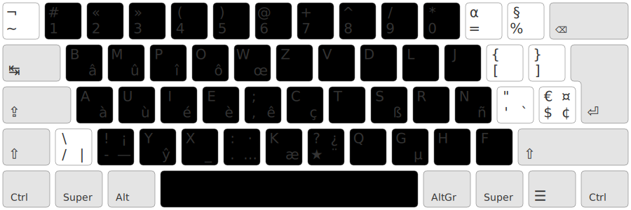
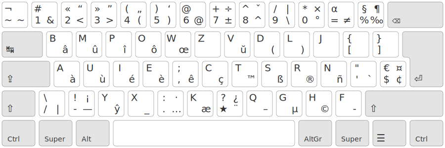
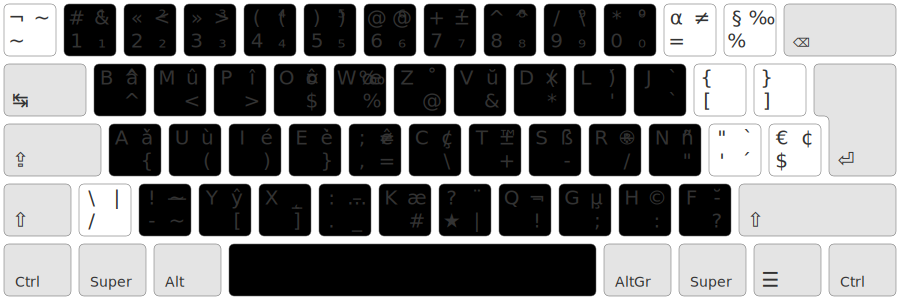

Bépolar
================================================================================

## TL;DR

Dérivée de BÉPO, Bépolar est une disposition clavier s’appuyant sur des mécanismes modernes afin d’améliorer le confort de frappe.
La disposition est plus confortable que BÉPO en français, et meilleure que BÉPO pour l’anglais et la programmation avec sa couche AltGr dédiée au développement.

Le principe est simple : amener les touches sous les doigts (notamment les diacritiques) grâce à la touche spéciale `★`, dite « typographique ». Voici une vue simplifiée de la disposition :



C’est un bon moyen, pour un bépoète, de tester l’approche 1DFH qui est l’essence d’[Ergo-L](https://ergol.org/) avec un temps d’apprentissage record.

👉 [Apprendre / tester](https://ergol.org/lafayette/#b%C3%A9polar)

## Sommaire
1. [⁉️ Pourquoi une nouvelle disposition ?](#pourquoi-une-nouvelle-disposition)
2. [📑 Cahier des Charges](#-cahier-des-charges)
3. [⌨ Disposition](#-disposition)
4. [🧩 Installation](#-installation) ➡️ ([Linux](#sous-linux), [Windows](#sous-windows), [MacOS](#sous-mac))
1. [💡 Faites votre propre disposition](#-faites-votre-propre-disposition)
2. [🙏 Mention](#-mention)


## ⁉️ Pourquoi une nouvelle disposition ?
BÉPO m’a permis de découvrir le monde de l’ergonomie clavier et je l’en remercie. Depuis sa sortie, d’autres dispositions (bien) plus optimisées ont vu le jour.

Mais…

**Apprendre une nouvelle disposition, c’est long et fastidieux**. Bépolar se veut le plus proche possible de BÉPO tout en évitant son principal problème : les caractères `M Z Ç W` sont ~~très~~ trop excentrés, ce qui cause des déviations ulnaires, principale [cause de TMS documentée](https://onlinelibrary.wiley.com/doi/epdf/10.1002/jor.20599).

Quelques défauts de BÉPO corrigés par Bépolar :

1. *L’anglais*. La disposition a été développée pour écrire principalement en **français**. Aujourd’hui, l’anglais s’est énormément développé et est de plus en plus utilisé, que ce soit dans des anglicismes ou tout simplement pour écrire à l’international. Écrire en anglais en BÉPO est extrêmement fastidieux, notamment à cause de la position du `W`, qui est très excentré.
2. *La précision*. Pour écrire du français correct, nous avons besoin de bien des diacritiques : sur les lettres `é è ù û à â ô ç`, pour ne citer que les plus courants en français. Sur des machines à écrire, il n’y a pas le choix, il faut impérativement utiliser plus de touches pour permettre une bonne typographie (majuscules accentuées, espace insécable, guillemets à la française, etc.). Le fait d’avoir plus de touches rend nécessairement les touches les plus éloignées moins confortables (et moins précises). Dvorak proposait d’excentrer les touches les moins utilisées. Le problème de cette approche, c’est que les touches les moins utilisées sont mises sur les positions les plus difficiles. Ainsi, il est bien plus fréquent de faire des fautes de frappe sur ces touches et l’apprentissage de la dactylographie est plus long.
3. *L’auriculaire droit*. `M` est une lettre fréquemment doublée, la mettre en extension sur un doigt faible n’est pas judicieux.
4. *La programmation*. Certains symboles de programmation ont des caractères très excentrés, comme le `$`, ce qui est fastidieux pour coder dans certains langages.

Tous les problèmes mentionnés ont la même origine, l’utilisation de touches excentrées. Il faut donc changer d’approche : ne plus aller chercher les touches loin avec les doigts, mais plutôt les amener sous les doigts – passer d’un paradigme *fingers-to-caps* à *caps-to-fingers* !

Pour cela, Bépolar agence toutes les lettres dans la zone la plus confortable du clavier : le pavé de 30 touches (3 colonnes × 5 touches × 2 mains). Ça tombe bien, c’est [bon pour la santé](https://www.researchgate.net/publication/12913559_Workplace_Use_of_an_Adjustable_Keyboard_Adjustment_Preferences_and_Effect_on_Wrist_Posture).

La disposition étant très proche de BÉPO, elle s’apprend *très* rapidement ; moins d’une petite semaine pour retrouver ma vitesse dans mon cas.

À ceux qui ne pratiquent pas BÉPO, je conseillerais plutôt de passer sur une disposition telle que [Ergo‑L](https://ergol.org/), plus optimisée que Bépolar, mais requérant un apprentissage long.

Pour ceux qui ne peuvent vivre sans Vim *et* qui ne souhaitent pas programmer leur clavier (via QMK ou un logiciel comme [Kanata](https://github.com/jtroo/kanata)), [QWERTY-Lafayette](https://qwerty-lafayette.org/) est un bon compromis.

### 📑 Le cahier des charges

Voici les contraintes que je me suis données :

* Le moins de changements possible par rapport à BÉPO – seules quatre (ou cinq sur un clavier ISO) touches doivent changer : `É È À ^ !` (`Ê`)
* Toutes les lettres sur le pavé des 30 (3 × 5 × 2) touches principales du clavier
* Les accents et autres diacritiques les plus communs obtenus via une touche morte de type [Lafayette](https://qwerty-lafayette.org/), où l’on mettra aussi quelques symboles typographiques utilisés en français
* Les chiffres accessibles en direct
* Une couche Alt dédiée à la programmation
* Garder une disposition intuitive

## ⌨ La disposition

### Couche classique — niveau 1 (couche Alpha)

La disposition Bépolar est présentée ci-dessous :


Légende :

* En clair, la touche frappée
* En rouge, les touches « mortes » : il faut les frapper puis enchaîner avec un autre caractère pour voir leur effet (comme le `^` en AZERTY)
* En vert, le résultat de la touche typographique (en forme d’étoile) combiné avec le caractère sur la touche courante

### Touche typographique — niveau 5 (techniquement un *iso_level_5_latch*, cousin d’AltGr)

La touche typographique, ou touche touche Typo, `★` (en rouge sur le layout), donne accès aux caractères en vert :

* Tous les accents communs en français (aigu, grave, circonflexe)
* Certains diacritiques usuels dans les langues européennes : `ç ñ`
* Les ligatures les plus courantes : `œ æ ß`
* D’autres symboles typographiques usuels tels que l’apostrophe typographique, les espaces insécables (fine ou non), les guillemets anglo-saxons, les points de suspension, le point médian `·`, le tiret insécable, etc.
* Des symboles mathématiques tels que `≠ ≃ ± × ₀₋₉⁰⁻⁹`.

L’ensemble des symboles accessibles sont présentés ici :


> ⚠ Ce n’est pas visible, mais la touche morte suivie d’espace permet de faire **l’apostrophe (typographique)**
>
> Le symbole `‑` sur la touche `F` (en bas à droite) est le « tiret insécable », qui permet d’être sûr qu’un nom composé ne soit pas coupé sur deux lignes, par exemple.

#### Principes

* La touche Typo (`★`) suivie d’une voyelle (rangée du milieu, ou *home row*) donne généralement cette dernière avec un accent grave (p. ex., `à`, `ù`, `è`).

* La touche Typo (`★`) suivie de la touche au-dessus de cette voyelle (rangée du haut) donne un accent circonflexe (p. ex., `â`, `û`, `î`, `ô`). ⚠ Exception pour le `ê`, qui est à la droite du `è`.
* La touche Typo (`★`) suivie de `i` donne `é`, ce qui facilite l’enchaînement `ée`.
* Deux appuis successifs sur la touche morte `★` donnent la touche morte trémas `*¨`. Pour faire un `ï`, par exemple, il faut faire l’enchaînement `★★i` (soit trois touches, mais les mots à trémas sont rares).
* La touche Typo (`★`) suivie d’un symbole ou d’une lettre ayant une variante courante donne cette variante : `★c` → `ç`, `★n` → `ñ`, `★s` → `ß`, `★=` → `≠`, etc.

L’utilisation de la touche Typo pour les accents n’est peut-être pas intuitive de prime abord. En effet, quand on tape à deux doigts comme le commun des mortels, toutes les touches se valent et il est préférable d’avoir une touche excentrée que de taper deux touches.
En revanche, quand on tape en position dactylo, toutes les touches excentrées sont pénibles et causes d’erreurs. Placer l’ensemble des lettres sur les 30 touches confortables du clavier est donc plus efficace, et favorise en même temps l’apprentissage grâce à la mémoire musculaire.

*In fine*, grâce aux touches classiques (niveau 1), à la touche shift/maj (niveau 2) et à la touche Typo (`★`, niveau 5), l’ensemble des symboles nécessaires pour saisir un français correct sont accessibles.
Il est en outre possible d’écrire correctement et confortablement à la fois le français et l’anglais ; dans une moindre mesure, l’allemand, l’espagnol et l’espéranto.

### Couche AltGr — niveau 3 (ISO level 3)

La couche AltGr est facultative. Elle permet de faciliter la programmation informatique en rendant accessibles l’ensemble des symboles utilisés pour coder sur la zone confortable du clavier.. En outre, elle donne accès à certaines touches mortes (souvent via shift), ce qui peut être pratique pour un usage ponctuel.

Cette couche est partagée entre les projets Bépolar, [Ergo‑L](https://ergol.org/) et [QWERTY-Lafayette](https://qwerty-lafayette.org/). Elle a été pensée pour les développeurs :

* en plaçant les symboles les plus courants aux endroits les plus accessibles
* en positionnant les symboles par blocs, pour faciliter l’apprentissage (`() [] {} ^$ +-/`)
* en facilitant l’utilisation de Vim



### Touche espace

La touche espace (␣) est utilisée pour les symboles suivants :

* L’espace classique : ` `
* L’espace insécable fine (shift+␣) : ` `
* L’espace insécable (AltGr+shift+␣) : ` `
* L’apostrophe typographique (★+␣) : `’`

> ⚠️ Contrairement au BÉPO, le tiret bas (`_`, *underscore*) n’est pas en AltGr+␣, mais en ★+x (ou AltGr+`.`). Cela permet d’enchaîner espaces et symboles de programmation en couche AltGr, et de composer facilement du texte en snake_case.

## 🧩 Installation

Les pilotes pour [Linux](#sous-linux), [Mac](#sous-mac) et [Windows](#sous-windows) sont disponibles dans le dossier `dist`.
Ces pilotes sont générés via le script [Kalamine](https://github.com/fabi1cazenave/kalamine). Je fournis la disposition pour tous les systèmes d’exploitation, mais **la version Linux est la plus testée**.

### Sous Linux

> **NB.** Sous Ubuntu/Wayland/Gnome, il est préférable de préciser l’utilisation d’Ibus (installé par défaut) pour avoir accès à l’ensemble des caractères et éviter les conflits avec QMK/Kanata, etc.
> Pour cela, il suffit d’ajouter au fichier `/etc/environment` :
>
> ```bash
>INPUT_METHOD=ibus
>GTK_IM_MODULE=ibus
>QT_IM_MODULE=ibus
>XMODIFIERS=@im=ibus
>```

#### Méthode simple : Wayland/X11

La façon la plus simple d’installer Bépolar est d’exécuter

```bash
sudo wget -O ${XKB_CONFIG_ROOT:-/usr/share/X11/xkb}/symbols/custom \
https://github.com/Ced-C/Bepolar/blob/master/dist/bepolar.xkb_custom
```

En fonction de l’environnement de bureau, il faut peut-être ensuite se déconnecter et **se reconnecter à sa session** pour que le système voie la nouvelle disposition dans les paramètres clavier. Elle ne sera pas dans la liste des dispositions du français, mais dans « custom » et sera nommée `custom / A user-defined custom layout`.

Pour installer la disposition sous son vrai nom, il faut passer par la méthode avancée.

#### Méthode avancée : compilation depuis les sources

Récupérer le layout de Bépolar :

```bash
wget https://github.com/Ced-C/Bepolar/blob/master/Bépolar.toml
```

Installer Kalamine :

```bash
pip3 install pipx # si nécessaire, pipx est une amélioration de pip
pipx install kalamine
```

```bash
# Pour générer les pilotes, téléchargez le fichier `Bépolar.toml` du répertoire et faites
kalamine build Bépolar.toml

# Pour installer la disposition qui appraraitra dans la catégorie Fr/Bépolar en user-space
xkalamine build Bépolar.toml

```

Pour installer la disposition qui apparaîtra dans la catégorie Fr/Bépolar sur tout le système (root), installez Kalamine via pyVenv puis faites

```bash
sudo xkalamine build Bépolar.toml
```

Il peut être nécessaire de se déconnecter et **se reconnecter à sa session**.

### Sous Mac

Il suffit de copier le fichier [bepolar.keylayout](dist/bepolar.keylayout) dans le dossier `/Library/Keyboard Layouts` et de **relancer la session**. La disposition de clavier est disponible dans les préférences « Clavier », rubrique « Méthodes de saisie ».
On peut aussi l’enregistrer dans `~/Library/Keyboard Layouts` (pour le seul utilisateur courant), mais la disposition ne sera pas active et disponible au login.
Il est possible (et recommandé) d’utiliser Karabiner pour inverser les touches ⌘Command et ⌥Option à droite, afin d’accéder plus facilement à la couche de symboles.

### Sous Windows

Si vous avez les droits d’administration sur votre poste Windows, utilisez l’installeur (`setup.exe`) disponible dans [Bépolar.zip](dist/bepolar-0.7.0-win.zip). Exécutez l’installeur et relancez la session. La disposition de clavier apparaît dans la barre de langues (indicateur de la barre des tâches).

Si vous n’avez pas les droits d’administration, une version portable est disponible : [Bépolar.ahk](dist/bepolar.ahk).
Après le lancement, un indicateur apparaît dans la barre des tâches. Le pilote peut être activé ou désactivé avec le raccourci Alt‑AltGr.

## 💡 Faites votre propre disposition

Si vous souhaitez modifier la disposition pour l’adapter à vos besoins, le fichier `Bépolar.toml` est lisible facilement et peut être modifié à la main avant d’utiliser Kalamine pour générer vos propres pilotes.

## 🙏 Mentions

Un *grand* merci à `Kazé` pour ses nombreux softs utiles, dont :

* Kalamine pour générer les pilotes
* X-keyboard pour générer les images de layout

Et pour son implication dans de nombreux projets, dont BÉPO et QWERTY-Lafayette.

De même, merci à :

* `Nuclear Squid` pour ses explications et son [serveur Discord](https://discord.gg/RH34GjQEgC), qui m’ont permis de me lancer dans le sujet
* `Lobre` pour ses retours éclairants
* `Aeshar` et `Brab` pour leur version custom `BMP`, de laquelle `Bépolar` est issue
* `aurelberra` pour ses contributions à ce readme !