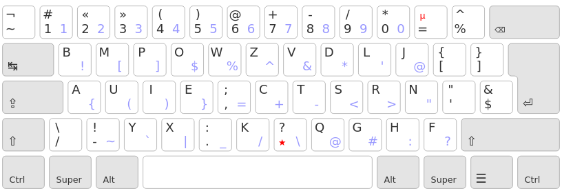
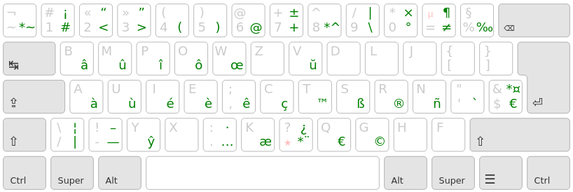
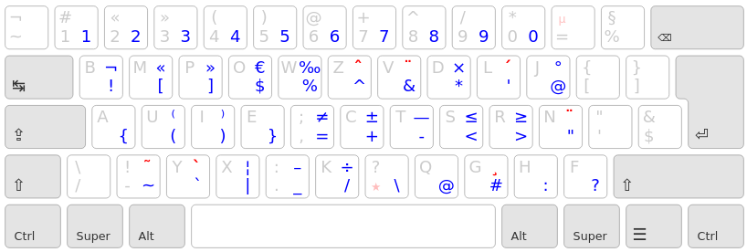

Bépolar
================================================================================

Dérivé de BÉPO, Bépolar est une disposition clavier s’appuyant sur des mécanismes modernes afin d’améliorer le confort de frappe.

## 📑 Cahier des Charges

* Le moins de changement possible par rapport à BÉPO
* Toutes les lettres sont situées sur le pavé des 30 (3x5x2) touches principales du clavier
* Les accents et autres diacritiques les plus communs via une touche morte de type [Lafayette](https://qwerty-lafayette.org/)
* Les chiffres accessibles en direct
* Une couche Alt dédiée à la programmation

Cette disposition se veut le meilleur compromis pour ceux qui ont déjà appris le BÉPO et ne veulent pas investir dans une nouvelle disposition. Elle permet de rester proche du BÉPO tout en s’éloignant des contraintes Dvorak issue des machines à écrire (alternance des mains, éparpillement des lettres accentuées au-delà des 30 touches, *etc.*).

Pour ceux ne connaissant pas BÉPO, je conseille plutôt de passer sur une disposition telle que [Ergo-L](https://ergol.org/) plus optimisée que Bépolar, mais requérant un apprentissage long.

Pour ceux qui ne peuvent vivre sans VIM, [QWERTY-Lafayette](https://qwerty-lafayette.org/) est un bon compromis.


## ⌨ Disposition
### Classique — Couche 0
La disposition Bépolar est présenté ci-dessous :


### Touche morte — Couche 3
La touche morte `*` donne accès à :
- Tous les accents communs en français (aigüe, grave, circonflexe)
- Certaine diacritique usuelle en langue européenne (ç, ñ)
- D’autres symboles typographiques usuels tels que l’apostrophe typographique, les espaces insécables (fine ou non), les guillemets anglo-saxons, les points de suspensions, le point médian, *etc.*
- Des symboles mathématiques tels que supérieur, inférieur, différent, multiplier, plus-ou-moins, pour-mille, *etc.*
L’ensemble des symboles accessibles sont ici présentés :


#### Principe
- La touche morte `*` suivie d’une voyelle (colonne du milieu ou *home row*) donne généralement cette dernière avec un accent grave (*i.e.* `à`, `ù`, `è`)
- La touche morte `*` suivie de la touche au-dessus de cette voyelle (colonne haute) donne un accent circonflexe (*i.e.* `â`, `û`, `î`, `ô`). ⚠ Exception pour le `ê` qui est à la droite du `è`
- La touche morte `*` suivie de `i` donne `é`
- Deux appuis successif sur la touche morte `**` donne une touche morte trémas `*¨`. Pour faire un `ï` par exemple, il suffit de faire l’enchainement `**i` (soit trois touches, mais les mots à trémas sont rares).

L’utilisation de la touche morte pour les accents n’est peut-être pas intuitive de prime abord, mais permet de placer l’ensemble des lettres sur les 30 touches, tout en favorisant l’apprentissage de la mémoire musculaire.


*In fine*, grâce aux touches classiques, (niveau 0), la touche shift/maj (niveau 1), et la touche morte `*` (niveau 3), l’ensemble des symboles nécessaires à taper un français correct sont accessibles.
Il est en outre possible d’écrire correctement en anglais, espagnol, Allemand et espéranto.

### Alt Gr. — Couche 2 et 4
La couche Alt. Gr est utilisé pour faciliter la programmation informatique en rendant accessible l’ensemble des symboles utilisé pour coder.



⚠ Cette couche n’est pas aussi mature que les autres et peut être amenée à évoluer davantage que la couche principale.

### La touche espace
La touche espace est utiliser pour les symboles suivants :
- L’espace classique : ` `
- L’espace insécable fine (shift+espace) : ` `
- L’apostrophe typographique (touche_morte+espace) : `’`
- L’underscore (AltGr+espace) : `_`
- L’espace insécable (AltGr+shift+espace) : ` `

## 🧩 Installation
Les pilotes pour Linux, Mac et Windows sont disponibles dans le dossier `dist`.
La dernière version de [Kalamine](https://github.com/fabi1cazenave/kalamine) est nécessaire pour générer la version actuelle ou une variante de Bépolar.

Pour installer Kalamine :
```bash
sudo pip install kalamine # Yes, you *do* need root privileges
```

Pour générer les pilotes, télécharger le fichier `Bépolar.yml` du répertoire et faites un :
```bash
kalamine Bépolar.yml
```
Il est ensuite possible d’utiliser les fichiers générer pour installer les pilotes dans votre système.
### Spécificité Linux :
Sous Linux Kalamine est capable d’installer et de supprimer des dispositions :
#### Sous X11
```bash
sudo xkalamine install Bépolar.yml # insalle la dispo
xkalamine apply Bépolar.yml # teste la dispo en locale
```

#### Sous Wayland
Il y a actuellement un bug connu sous kalamine qui l’empêche de bien fonctionner sous wayland. Pour y remédier :
```bash
xkbpath=/usr/share/X11/xkb
# sauvegarde de la config actuelle
sudo cp $xkbpath/rules/evdev.xml $xkbpath/rules/evdev.xml.bk
sudo cp $xkbpath/rules/base.xml $xkbpath/rules/base.xml.bk
sudo cp $xkbpath/symbols/fr $xkbpath/symbols/fr.bk

sudo xkalamine install Bépolar.yml
# supprime les varibles qui posent problèmes pour wayland
sudo python3 ./script/kalamine_clean.py
# kalamine n’est plus capable de supprimer la disposition, mais, `sudo ./set_org_xkb.sh` permet de revenir comme avant si les étapes précédantes ont bien été suivies.
```


## 💡 Faites votre propre disposition
Si vous souhaitez modifier la disposition pour l’adapter à vos besoins, le fichier `Bépolar.yml` est lisible facilement et peut être modifié à la main avant d’utiliser kalamine pour générer vos propres pilotes.

## 🙏 Mention
Un grand merci à `Kazé` pour ses nombreux softs utiles dont :
- kalamine pour générer les pilotes
- X-keyboard pour générer les images de layout

Et son implication dans de nombreux projet (BÉPO, QWERTY-lafayette)

De même, merci à :
- `Nuclear Squid` pour ses explications, et son [serveur discord](https://discord.gg/RH34GjQEgC) qui m’ont permis de me lancer dans le sujet
- `Lobre` pour ses retours éclairants
- `Aeshar` & `Brab` et leur version custom `BMP` sur laquelle `Bépolar` est issue.